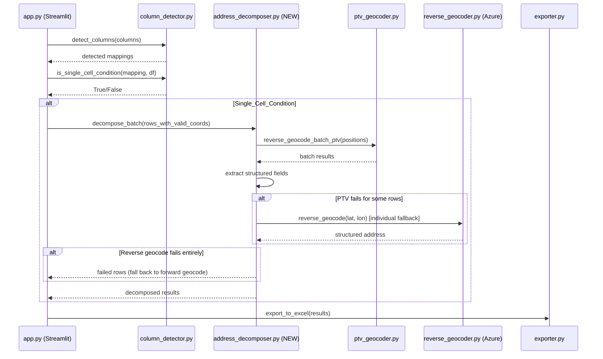

# Design Document: Reverse Geocode from Lat/Long

## Overview

This feature adds a third geocoding path to GeoClean: when uploaded data contains valid latitude/longitude coordinates alongside a single combined address column (no separate street, city, state, or postal code columns mapped), the system uses reverse geocoding to decompose the combined address into structured address components.

The key distinction from the existing Path 1 (PTV batch reverse for verification/road-snapping) is that this new path uses reverse geocoding to **extract address components** (street, number, city, state, postal_code) rather than to verify or snap existing coordinates. The coordinates are treated as the authoritative source for generating structured address fields.

### Processing Flow Summary

```
Upload → Column Detection → Condition Check
                                ├── Single_Cell_Condition → Path 3: Reverse geocode to decompose address
                                ├── Has coords + structured address → Path 1: PTV batch reverse (verify/snap)
                                └── No coords → Path 2: Forward geocode
```

## Architecture

### Integration Point

The Single_Cell_Condition detection occurs **after** column mapping is finalized and **before** the existing path split in `app.py`. The new path is evaluated first, and rows that don't qualify fall through to the existing Path 1/Path 2 logic.

### Component Interaction



### Mode Detection Enhancement

The `column_detector.py` module gains a new mode: `"decompose"`. The mode hierarchy becomes:

1. **"decompose"** — lat/lon mapped + address column mapped + NO separate street/city/state/postal mapped → reverse geocode to extract components
2. **"verify"** — lat/lon mapped + structured address fields mapped → verify coords against geocoded results  
3. **"geocode"** — no coords, has address fields → forward geocode
4. **"insufficient"** — not enough data

## Components and Interfaces

### 1. Enhanced Column Detector (`modules/column_detector.py`)

**New function: `is_single_cell_condition(mapping, df)`**

```python
def is_single_cell_condition(mapping: Dict[str, str], df: pd.DataFrame) -> bool:
    """
    Determine if the Single_Cell_Condition is met:
    - Latitude column is mapped and contains at least one valid value
    - Longitude column is mapped and contains at least one valid value
    - Address column is mapped and contains at least one non-empty value
    - NO separate street, city, state, or postal_code columns are mapped
    
    Args:
        mapping: The finalized column mapping dict from the UI (keys: 'latitude', 
                 'longitude', 'address', 'street', 'city', 'state', 'postal_code')
        df: The uploaded DataFrame
    
    Returns:
        True if Single_Cell_Condition is met.
    """
```

**Modified function: `get_mode(detected)`**

Returns `"decompose"` when Single_Cell_Condition is detected (in addition to existing modes).

### 2. New Address Decomposer Module (`modules/address_decomposer.py`)

This is the orchestration module for the new path. It handles coordinate validation, batch reverse geocoding, fallbacks, and result formatting.

```python
def validate_coordinate(lat, lon) -> Tuple[bool, str]:
    """
    Validate a single coordinate pair for reverse geocoding eligibility.
    
    Returns:
        Tuple of (is_valid, reason_if_invalid)
    
    Validation rules:
    - lat must be numeric and in [-90, 90]
    - lon must be numeric and in [-180, 180]
    - (0, 0) is treated as invalid
    - NaN, None, empty string are invalid
    """

def decompose_batch(
    prepared_rows: List[Dict],
    progress_callback=None,
) -> Tuple[List[Dict], List[Tuple[int, Dict]]]:
    """
    Process rows meeting Single_Cell_Condition via reverse geocoding.
    
    Args:
        prepared_rows: List of dicts with 'existing_lat', 'existing_lon', 'addr', etc.
        progress_callback: Optional callback(done, total) for progress updates.
    
    Returns:
        Tuple of:
        - results: List of result dicts (same length as input, None for failed rows)
        - fallback_rows: List of (index, prepared_row) tuples for rows that need 
                         forward geocoding fallback
    
    Process:
    1. Validate coordinates for each row
    2. Batch reverse geocode valid coordinates via PTV
    3. For PTV failures, retry individually (up to 2 attempts) then try Azure Maps
    4. Build standard result dicts with decomposed address fields
    5. Return failed rows for forward geocoding fallback
    """

def _build_decompose_result(
    prep: Dict, 
    reverse_result: Dict,
    source: str = "Reverse Geocode (Lat/Long)"
) -> Dict:
    """
    Build a standard GeoClean result dict from a reverse geocode response,
    focused on address decomposition rather than coordinate verification.
    
    The result preserves the original combined address and populates:
    - street (from reverse geocode street + houseNumber)
    - city
    - state  
    - postal_code
    - country_code
    - formatted_address
    
    The latitude/longitude remain as the original input coordinates
    (they are the source of truth, not being snapped/verified).
    """
```

### 3. Enhanced App Orchestration (`app.py`)

The geocoding orchestration section gains a new path evaluated before the existing split:

```python
# ── Path 0: Address Decomposition (Single_Cell_Condition) ──
# Rows with valid coords + only combined address → reverse geocode to extract components
if is_single_cell and rows_qualifying_for_decompose:
    ...
    
# ── Path 1: PTV batch reverse geocode (rows with coords + structured address) ──
# (existing behavior)

# ── Path 2: Parallel forward geocode (rows without coords) ──
# (existing behavior)
```

### 4. Enhanced Exporter (`modules/exporter.py`)

No structural changes needed. The existing `results_to_dataframe()` and `export_to_excel()` functions already handle all the fields that the decomposer will populate. The `geocoding_source` field distinguishes this path: `"Reverse Geocode (Lat/Long)"`.

The `original_address` field in the result dict preserves the combined address for traceability.

## Data Models

### Input Row (prepared_row dict)

Already defined in `app.py`'s `prepare_row()`:

```python
{
    'addr': str,           # Combined address from mapped address column
    'street': str,         # Empty (not mapped in Single_Cell_Condition)
    'city': str,           # Empty (not mapped)
    'state': str,          # Empty (not mapped)
    'postal': str,         # Empty (not mapped)
    'country': str,        # May be populated if country column exists
    'cc': str,             # Country code if available
    'existing_lat': float, # Latitude from mapped column
    'existing_lon': float, # Longitude from mapped column
    '_original_row': dict, # All original columns preserved
}
```

### Decompose Result Dict

Output from `_build_decompose_result()`, compatible with existing GeoClean result format:

```python
{
    # Identity
    'original_address': str,    # Original combined address (preserved unmodified)
    'base_address': str,        # Same as original_address for this path
    'unit_text': '',
    'is_multi_unit': False,
    
    # Coordinates (kept as-is from input — these are authoritative)
    'latitude': float,          # Original lat (not snapped)
    'longitude': float,         # Original lon (not snapped)
    'existing_lat': float,      # Same as latitude
    'existing_lon': float,      # Same as longitude
    
    # Decomposed address fields (from reverse geocoding)
    'formatted_address': str,   # Full formatted address from API
    'street': str,              # Street name + number (or empty if API didn't return)
    'postal_code': str,         # Postal code (or empty)
    'city': str,                # City/municipality (or empty)
    'state': str,               # State/province (or empty — new field for this path)
    'district': str,            # District/neighborhood
    'country': str,             # Country name
    'country_code': str,        # ISO alpha-2 code
    
    # Scoring and metadata
    'precision': 'Reverse Geocode',
    'confidence_score': float,  # From API quality score, or 0.5 default
    'confidence_level': str,    # 'High' | 'Medium' | 'Low'
    'output_strategy': 'decomposed_address',
    'needs_review': bool,       # True if reverse geocode returned sparse data
    'recommendation': str,      # Human-readable explanation
    'geocoding_source': 'Reverse Geocode (Lat/Long)',
    
    # Verification (minimal for this path — coords are the source)
    'verification_status': 'source_coords',
    'verification_message': str,
    'distance_from_existing': 0,
    'map_link_existing': str,
    'map_link_suggested': '',
    'map_link_compare': '',
    
    # Passthrough
    '_original_row': dict,
    
    # Geocode alternatives (empty for this path)
    'entrance_source': '',
    'entrance_type': '',
    'geocode_alternatives': [],
}
```

### Coordinate Validation Result

```python
{
    'is_valid': bool,
    'reason': str,  # '' if valid, else: 'out_of_range', 'zero_zero', 'non_numeric', 'empty'
}
```


## Correctness Properties

*A property is a characteristic or behavior that should hold true across all valid executions of a system—essentially, a formal statement about what the system should do. Properties serve as the bridge between human-readable specifications and machine-verifiable correctness guarantees.*

### Property 1: Single_Cell_Condition Detection

*For any* column mapping where latitude, longitude, and address columns are mapped (not "(none)" or empty) and the DataFrame has at least one non-empty address value, AND no separate street, city, state, or postal_code columns are mapped (or their mapped columns contain only empty/NaN values), `is_single_cell_condition` SHALL return True. Conversely, *for any* mapping where at least one structured field (street, city, state, postal_code) is mapped to a column containing at least one non-empty value, it SHALL return False.

**Validates: Requirements 1.1, 1.2, 1.4, 1.5**

### Property 2: Reverse Geocode Response Mapping

*For any* valid PTV or Azure Maps reverse geocode API response dict, `_build_decompose_result` SHALL populate street, city, state, postal_code, and country_code from the response fields, and SHALL leave any field as an empty string when the corresponding API response field is absent or empty (never None or a placeholder value).

**Validates: Requirements 2.2, 2.3**

### Property 3: Error Handling Preserves Original Address

*For any* row where reverse geocoding returns an error or empty result, the decomposer SHALL produce a result where `original_address` equals the input combined address, `needs_review` is True, and `recommendation` contains a non-empty descriptive message about the failure.

**Validates: Requirements 2.4**

### Property 4: Coordinate Validation

*For any* latitude value outside [-90, 90], longitude value outside [-180, 180], non-numeric value (string, None, NaN, empty), or the coordinate pair (0.0, 0.0), `validate_coordinate` SHALL return `(False, reason)` where reason is a non-empty string describing the failure. Conversely, *for any* numeric latitude in [-90, 90] and longitude in [-180, 180] where at least one is non-zero, it SHALL return `(True, '')`.

**Validates: Requirements 4.1, 4.2, 4.3**

### Property 5: Invalid Coordinates with Empty Address Produce Zero-Confidence Review

*For any* row with invalid coordinates (per Property 4) AND an empty/whitespace-only combined address, the decomposer SHALL produce a result with `needs_review=True`, `confidence_score=0.0`, and a non-empty `recommendation` describing the validation failure.

**Validates: Requirements 4.4, 4.5**

### Property 6: Output Format Completeness

*For any* result produced by the address decomposer (whether successful or failed), the result dict SHALL contain all required GeoClean output fields (original_address, latitude, longitude, confidence_score, confidence_level, needs_review, geocoding_source, formatted_address, postal_code, city, country_code, output_strategy, recommendation, verification_status), AND the `geocoding_source` field SHALL equal `"Reverse Geocode (Lat/Long)"`.

**Validates: Requirements 5.3, 5.4, 7.2**

### Property 7: Original Address Preservation

*For any* input row processed by the address decomposer, the `original_address` field in the output SHALL be byte-for-byte identical to the combined address value from the input row, regardless of whether reverse geocoding succeeded or failed.

**Validates: Requirements 3.2, 7.1**

### Property 8: Confidence Score Bounds and Defaults

*For any* result produced by the address decomposer, `confidence_score` SHALL be a float in the range [0.0, 1.0]. Additionally, *for any* API response that does not include a quality/confidence score, the result SHALL have `confidence_score=0.5` and `confidence_level="Medium"`.

**Validates: Requirements 7.3, 7.4**

### Property 9: Partial Batch Failure Retry Limit

*For any* batch of positions where some positions fail in the batch response, the decomposer SHALL retry each failed position individually up to a maximum of 2 additional attempts before marking the row for review or fallback.

**Validates: Requirements 6.3**

## Error Handling

### Coordinate Validation Errors

| Condition | Behavior |
|-----------|----------|
| Latitude outside [-90, 90] | Skip reverse geocode, fall back to forward geocode |
| Longitude outside [-180, 180] | Skip reverse geocode, fall back to forward geocode |
| (0.0, 0.0) coordinates | Treat as invalid, fall back to forward geocode |
| Non-numeric lat or lon | Skip reverse geocode, fall back to forward geocode |
| Empty/NaN lat or lon | Skip reverse geocode, fall back to forward geocode |
| Invalid coords + empty address | Set confidence=0, needs_review=True, no fallback possible |

### API Errors

| Condition | Behavior |
|-----------|----------|
| PTV batch submission fails | Fall back to Azure Maps individual calls |
| PTV batch partially fails | Retry failed positions individually (max 2 retries), then try Azure |
| PTV individual call fails | Fall back to Azure Maps reverse_geocode() |
| Azure Maps fails | Mark row for forward geocode fallback |
| Both PTV and Azure fail | Retain original address, needs_review=True, descriptive message |
| API timeout | Same as API failure — retry then fallback |
| HTTP 429 (rate limit) | Retry with backoff (handled by existing batch mechanism) |

### Data Quality Errors

| Condition | Behavior |
|-----------|----------|
| API returns empty result set | Retain original address, needs_review=True |
| API returns address with no street | Leave street field empty, set needs_review=True if critical fields missing |
| API returns low quality score (<30) | Set confidence_level="Low", needs_review=True |
| All rows in file have invalid coords | Entire file falls back to forward geocode path |

## Testing Strategy

### Property-Based Tests (using Hypothesis for Python)

Each correctness property (1–9) will be implemented as a property-based test using the [Hypothesis](https://hypothesis.readthedocs.io/) library. Configuration:

- **Minimum iterations**: 100 per property test
- **Tag format**: `# Feature: reverse-geocode-from-latlong, Property {N}: {title}`
- **Library**: `hypothesis` with `@given` decorator and custom strategies

**Custom generators needed:**
- `column_mapping_strategy()` — generates valid/invalid mapping dicts with realistic column names
- `dataframe_strategy(mapping)` — generates pandas DataFrames matching a given mapping
- `api_response_strategy()` — generates PTV/Azure reverse geocode response dicts with random field presence
- `coordinate_strategy(valid=True|False)` — generates valid or invalid coordinate pairs
- `prepared_row_strategy()` — generates prepared_row dicts with various field combinations

### Unit Tests (using pytest)

Unit tests cover specific examples and integration points:

- **Detection examples**: Known file layouts (Peru logistics data, US delivery data) produce correct mode detection
- **UI notification**: Single_Cell_Condition triggers the info message in Streamlit
- **Fallback chain**: PTV failure → Azure fallback → forward geocode fallback
- **Batch integration**: Verify batch is called with correct parameters (batch_size=500, max_concurrent=4)
- **Export format**: Decomposed results appear correctly in OptiFlow Import sheet
- **Progress callback**: Verify progress_callback is invoked during batch processing

### Integration Tests

- **End-to-end with mocked APIs**: Upload a file with lat/lon + combined address, verify structured fields in output
- **PTV → Azure fallback**: Mock PTV to fail, verify Azure is called and produces valid output
- **Mixed file**: File with some rows meeting Single_Cell_Condition and others not — verify correct path routing
